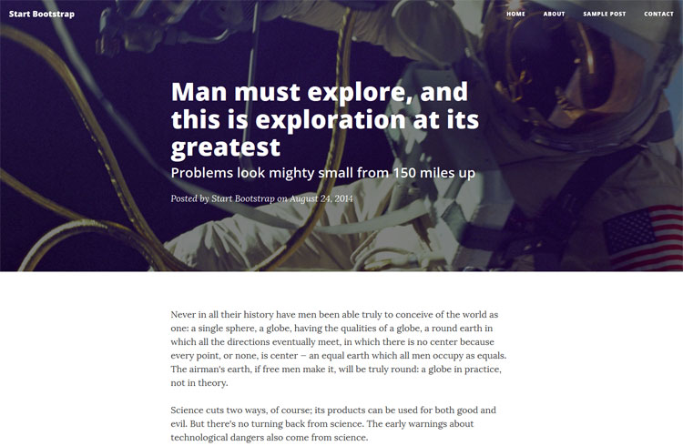

# Clean Blog for Habari #

I took the Clean Blog template developed by the fine folks at [Start Bootstrap](http://startbootstrap.com) and threw together this template for [Habari](http://habariproject.org).

It's currently in alpha, the theme functions similar to the web counterpart but it's barebones. Header images are static (one for home, one for single entires and one for page entires). They can be changed out on the fly by updating the appropriate img but not for individual entries. Also, comments are stripped in this release.

The template does support menus created in Habari. They will automatically fill out the navbar. Images attached in posts will need their class set to img-responsive for automatic resizing.

My site is running a slightly modified version if you want to see it in action. [Check it Out](http://hullomoe.com)

## To-Do List ##

* Allow for custom header images on posts and pages
* Logo support
* Subtitle support
* Comments support
* Post mage embedding 
